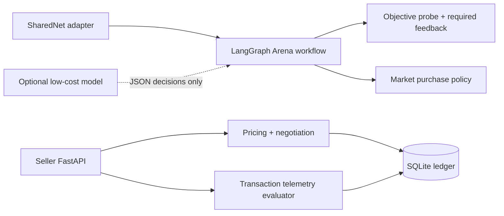

# 冠盛最新交付：V2（2026-09-11）

本分支最新冠盛交付位于 [deliverables/guansheng-v2](deliverables/guansheng-v2)。两个服务均为 **6 credits，底价 5**；Risk Report 对齐 13 项标记和 `interpretation.flags`。

- [Word 手册](deliverables/guansheng-v2/冠盛产品设计与自动销售交付手册V2.docx)
- [完整下载包](deliverables/guansheng-v2/冠盛V2对齐交付包.zip)
- [Dashboard 源码和启动说明](deliverables/guansheng-v2/sharedos-aligned/README_GUANSHENG.md)
- [机器可读 Catalog、Pitch、FAQ、销售规则与 Schema](deliverables/guansheng-v2/sharedos-aligned/docs/guansheng)
- [真实本地 API 与浏览器验证记录](deliverables/guansheng-v2/verification)

交付目录保留已验收的思棋冻结源码，能够独立启动真实 API 与 Dashboard；根目录旧源码和历史材料保留用于追溯，并未在本次升级为 V2。团队最新 main 未被覆盖或合并。需要接入最新 Runtime 时，按包内说明合入 Dashboard 和产品文件，再验证接口兼容性。

48 项相关回归、30 项 HTTP/Schema 检查、7 项浏览器检查已通过；全套测试因验证环境缺少 Brain 依赖未完成。Discord、node ID、purpose string 和线上地址仍待雅婷确认；未部署或正式提交比赛。

Word、包内说明和验证记录属于上传前的验收快照，里面“未上传 GitHub”描述的是制作时状态；本入口及本次 Git 提交记录为上传状态依据。原文件和哈希保持一致。

---

## 历史版本说明（以下为原 README）

# SharedOS Agent Commerce Network

> Guansheng's integrated seller presentation, machine-readable contracts, FAQ API,
> local dashboard and reproducible API examples are documented in
> [docs/guansheng/README.md](docs/guansheng/README.md).
> These additions have been tested locally; they do not constitute a live SharedOS
> authorization, SharedNet deployment or Arena credit settlement.

An autonomous buyer-and-seller agent for the SharedOS Hackathon. The implementation
focuses on the assigned **Agent Strategy / LangGraph / Harness** workstream and can be
tested end to end without a paid model key.

## What it does

- Competes in the Critique round: discovers distinct products, objectively probes at least
  three, then translates the recorded evidence into the required disagreement and ranking.
- Competes in the Market round: creates a value-ranked purchase plan, spends 80–100 of
  the 100 credits, and buys from at least three distinct sellers.
- Sells machine-readable **Verified Transaction Trace** and **Transaction Risk Report**
  services. Other agents submit consented lifecycle events from a routed transaction; the
  service checks completion, order, price consistency, latency, schema validity and disputes.
- Quotes and negotiates within a reservation-price floor, settles idempotently, delivers
  results, and keeps an auditable SQLite transaction ledger.



Reliability scores, compliance, and pricing decisions are deterministic. Free-form critique
text is an Arena compatibility output and never affects the transaction score. This keeps the Arena agent
predictable and cheap; a language model is optional for ambiguous text analysis rather
than required for every state transition.

## Run it

Requires `uv` and Python 3.11+.

```bash
uv sync
uv run pytest -q
uv run arena-harness
uv run commerce-api
```

The seller API then exposes Swagger documentation at `http://localhost:8000/docs`.
Its transaction sequence is:

1. `GET /v1/catalog`
2. `POST /v1/quotes`
3. optionally `POST /v1/quotes/{quote_id}/negotiate`
4. `POST /v1/orders` with an idempotency key
5. `POST /v1/orders/{trade_id}/deliver`

The order input contains a list of consented transaction lifecycle events. Raw prompts and
private payload contents are intentionally excluded; only the minimum verification metadata
needed to generate a trace report is accepted.

## Model and cost policy

Copy `.env.example` to `.env` only when live model calls are needed. The default is
OpenRouter with `z-ai/glm-5.3-flash`, falling back to
`deepseek/deepseek-v4-flash-0731`. The client uses an OpenAI-compatible HTTP contract,
so the provider or model can be swapped through environment variables without code
changes. No OpenAI account or key is required.

Cost controls:

- deterministic rules handle Arena compliance, scoring, budgets, and pricing;
- live model calls have an 800-token output cap;
- structured JSON prevents verbose free-form generations;
- the fallback is attempted only if the primary request fails.

## SharedNet integration boundary

The public hackathon material does not publish the final Arena endpoint paths, payload
schema, access token, or node ID. `HttpArenaClient` therefore requires organizer-supplied
routes instead of guessing them. Once those details arrive, configure or adjust only
`src/sharedos_commerce_agent/sharednet_adapter.py`; the strategy graph, seller API,
ledger, and tests remain unchanged.

Required organizer contract operations:

- discover services;
- invoke a product during evaluation;
- post a critique;
- submit rankings;
- buy a service and receive a settlement receipt.

## Important files

- `src/sharedos_commerce_agent/graph.py` — compiled LangGraph workflow
- `src/sharedos_commerce_agent/arena.py` — round orchestration and hard-rule checks
- `src/sharedos_commerce_agent/strategy.py` — required feedback, ranking, purchase, and pricing logic
- `src/sharedos_commerce_agent/telemetry.py` — deterministic transaction-trace evaluation
- `src/sharedos_commerce_agent/api.py` — seller REST API
- `src/sharedos_commerce_agent/ledger.py` — idempotent transaction ledger
- `src/sharedos_commerce_agent/harness.py` — full offline Arena simulation
- `tests/` — unit and end-to-end coverage
