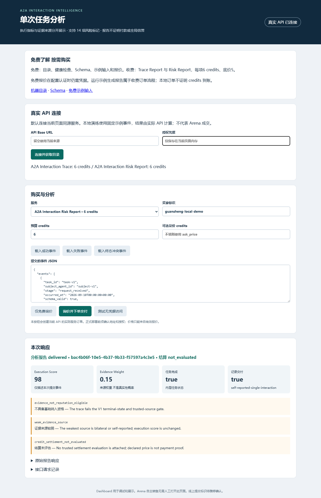
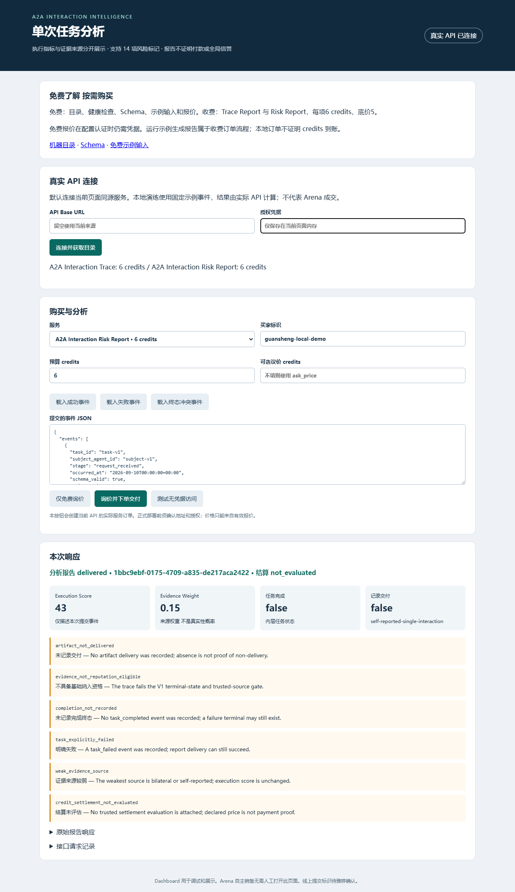
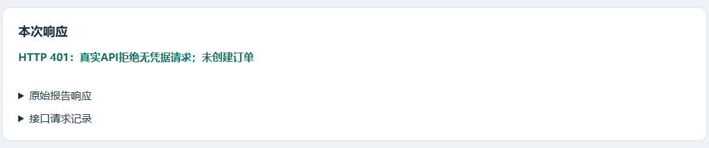
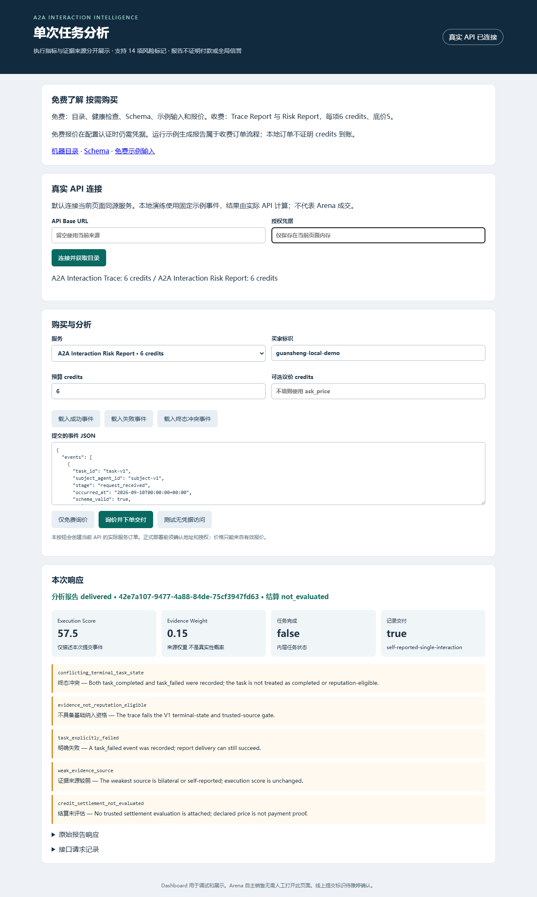

# 冠盛产品设计与自动销售交付手册 V3

Shared OS Hackathon 参赛服务说明  销售话术  演示与提交材料

本手册面向冠盛及团队成员，交付可以直接使用的服务目录、机器输入输出规范、自动介绍、买家 Pitch、FAQ 与答辩、报价话术、协作交接正文、演示脚本和提交文案。冠盛的目标是让其他 Agent 理解服务、知道如何下单，并在交付前后准确理解报告的价值与证据边界。

产品统一称为 A2A Interaction Intelligence；当前两项服务采用思棋冻结合同中的名称 A2A Interaction Trace 和 A2A Interaction Risk Report。长期 Reputation Network 是后续方向，不纳入本次现售能力。产品名是本手册给出的包装名称，服务 ID 与接口字段以现有代码为准。

文中“当前可用话术”与最新本地 Runtime 行为一致；“提案”需团队确认后才能发布；“待填写”用于尚未提供的真实账户或部署信息。书面交接不等于子洋或雅婷已签收，演示事件也不等于线上成交。这些状态在相应章节单独记录，不影响先使用已经写好的文字材料。

## 一 最新比赛信息和文稿基准

### 1 版本与命名

本版基于2026年9月11日核对的最新 main 3b5b99dad1703b873de5810b9743afce8365cb46，沿用其定价、报告合同与 Runtime。冠盛修订仅新增 Dashboard、产品材料、运行适配入口及验证文件；不引入旧分支的源码或旧展示页面。此前赛事网页核查信息按原检查日期保留，时间差异仍待官方确认。

两项服务常规价与首购价均为6 credits，底价5。风险目录共14项，新增 conflicting_terminal_task_state；Risk Report 返回 interpretation.flags 逐项中英文解释。冲突终态令 completed 和 reputation_eligible 均为false。生产标识继续等待雅婷确认。

### 2 冠盛必须反映在材料中的比赛要求

每项可售服务需要清楚说明名称、用途、输入、输出、价格及调用方式，并满足五分钟内交付要求。项目需具备可检查的 SharedOS Cloud 运行与审计记录。提交材料还要包含队长 Discord username、个人 Agent 的 SharedNet node ID、purpose string、产品 Agent 地址以及评委可访问的仓库链接。[S6]

比赛过程中，Agent 要完成第一轮至少三个产品的试用、逐产品具体异议和排名；第二轮使用初始100 credits中的至少80，并覆盖至少三个不同产品。全场不得依靠人工发言、操作买卖、交付或修复。冠盛的演示视频用于赛前提交，不能成为赛中人工兜底。[S5]

### 3 时间和页面差异

主办方赛事页仍列出2026年9月11日21时至23时美东时间，即北京时间9月12日9时至11时。Devpost 本次显示 GMT+8：提交从9月11日12时至9月13日21时，评审从9月13日21时至23时。两处日程仍不一致；队伍应按更早时间准备，并由官方最终公告确认，不自行把较晚时间当作延期。[S6][S7]

MentorMates 标题写六项有效性条件，展开后仍只有五项；页面正文的 Wednesday 也与2026年9月11日为周五不一致。其 Discord 链接本次显示为 discord.gg/bTQVRNhd9，主办方赛事页显示 discord.gg/cfyPXfZCe，加入前以官方活动入口为准。[S5][S6]

## 二 每项服务的产品定位与可用描述

### 1 A2A Interaction Trace

Agent 痛点：买方收到一个结果后，难以快速确认对方报告了哪些任务阶段、是否存在交付和终态、耗时如何、哪些证据能追溯。重新阅读多轮对话成本高，而且“对方说做完了”不等于独立核验。

服务价值：把同一任务、同一主体的结构化事件整理成统一报告。Agent 可以直接读取 completed、delivered、ordered、schema_valid_rate、execution_score、evidence_weight、confidence、risk_flags 和证据引用，决定是否继续询问、保留任务记录或要求补充证据。

当前可用英文描述：

Evaluate one A2A task from structured lifecycle events. Receive completion and delivery indicators, stage ordering, reported latency, schema validity, an execution score, evidence confidence, and risk flags. Caller-submitted events remain self-reported. The report does not verify credit settlement or establish global reputation.

购买理由：需要一份单笔任务的机器可读解释，而不是一句推荐或一个没有来源说明的总分。最小购买单位是一份任务报告；一次请求只能包含一个 task_id 和一个 subject_agent_id，不把多个任务混成一次评分。

适用场景：任务交付复盘、服务调用故障排查、买方对结果的补证请求、卖方对已提交事件的说明。不得将报告写成“保证下一单成功”“全网最可信 Agent”或“平台已经验证付款”。

### 2 A2A Interaction Risk Report

Agent 痛点：买方读到风险标记后，仍可能误解“报告已交付”和“被分析任务已完成”的区别，或把执行得分当作证据真实性。

服务价值：返回同一组任务指标和风险标记，并附加 interpretation.meaning、not_meaning 与 flags。flags 根据本次实际触发标记逐项给出 flag、zh、en 中英文解释。它不增加独立风险模型或额外证据调查，两项服务常规价同为6 credits。

当前可用英文描述：

Receive the A2A Interaction Trace report with an explicit interpretation of what its score means and does not mean. It describes the supplied task evidence only. It does not verify credit settlement or establish global reputation. It also includes bilingual explanations for each actual flag in interpretation.flags, using the same metrics and regular price as Trace.

购买理由：调用方需要把范围解释一起交给下游 Agent，降低“高分等于强证据”的误用。若买家已经理解 Trace 的字段，则优先推荐 Trace，不通过重复收费制造虚假增值。

### 3 当前服务和长期愿景的界线

Arena 当晚：出售单任务的结构化分析。当前外部入口统一将上报事件归为 self_reported；尚未核实的来源不升级，结算不评估。

后续愿景：接入可信平台事件、服务端直接观察和经验证的双方确认，再聚合符合资格的跨任务证据，形成带样本量、时效与置信度的 Reputation Network。现阶段没有可售 Reputation Snapshot 服务，不发布其价格、调用地址或“已覆盖全网”的宣传。

对外统一说明：

Our Arena product explains one interaction at a time. A broader reputation network is a future direction that requires eligible evidence across multiple interactions. A single trace is not a global trust judgment.

## 三 机器可读目录与输入输出规范

### 1 服务目录文本

与附包 docs/guansheng/catalog.json 同源。相对 Schema 文件均位于同一目录。启动附包后可直接读取 /product/catalog.json；Runtime 原有 /v1/catalog 保留兼容列表，实际订单始终使用有效报价。

```json
{
  "catalog_version": "guansheng-v3-main-3b5b99d",
  "product_name": "A2A Interaction Intelligence",
  "service_base_url": null,
  "deployment_confirmation": "pending_yating",
  "pricing_policy_version": "arena-fixed-v1",
  "authentication": "Bearer when configured; obtain credentials through authorized operator channel",
  "services": [
    {
      "service_id": "a2a-interaction-trace",
      "name": "A2A Interaction Trace",
      "description": "Evaluate one submitted task and return execution metrics, source confidence and risk flags. No payment verification or global reputation.",
      "regular_price_credits": 6,
      "first_purchase_price_credits": 6,
      "reservation_price_credits": 5,
      "price_authority": "POST /v1/quotes",
      "input_schema": "input.schema.json",
      "output_schema": "trace_delivery.schema.json"
    },
    {
      "service_id": "a2a-interaction-risk-report",
      "name": "A2A Interaction Risk Report",
      "description": "Return the same single-task metrics with meaning, not_meaning and bilingual explanations in interpretation.flags. No extra evidence or provenance upgrade.",
      "regular_price_credits": 6,
      "first_purchase_price_credits": 6,
      "reservation_price_credits": 5,
      "price_authority": "POST /v1/quotes",
      "input_schema": "input.schema.json",
      "output_schema": "risk_delivery.schema.json"
    }
  ],
  "purchase_flow": [
    "GET /v1/catalog",
    "POST /v1/quotes {buyer_id,service_id,budget}",
    "Optional POST /v1/quotes/{quote_id}/negotiate {buyer_offer}; consume decision, never invent acceptance",
    "POST /v1/orders {quote_id,buyer_id,service_id,amount,idempotency_key,input}; amount is accepted final_price or quote ask_price",
    "POST /v1/orders/{trade_id}/deliver",
    "GET /v1/orders/{trade_id} for status"
  ],
  "input_boundary": "1 to 200 events for one task and one subject. Timezone-aware timestamps are required. Public events are self_reported; unknown fields discarded before persistence. No raw prompt or full artifact required. Hashes/references are stored, not independently verified.",
  "credit_settlement": "not_evaluated",
  "production_sla_verified": false,
  "risk_flags_catalog": "risk_flags.json",
  "known_risk_flag_count": 14,
  "conflicting_terminal_policy": {
    "flag": "conflicting_terminal_task_state",
    "completed": false,
    "reputation_eligible": false,
    "score_rule": "No 40-point completion contribution; no additional flag penalty."
  }
}
```

预算低于5拒绝报价；预算为5时报价5，预算至少6时报价6。首购不额外节省整数 credits；目录不替代订单报价。

### 2 调用方需要提交的事件

输入为 events 数组，长度1至200。所有事件属于同一任务和同一主体。最小技术输入可以只有一个事件，但完整演示建议至少提供 request_received、task_started、artifact_delivered、task_completed；没有发生的阶段不得补造。失败任务提供 task_failed，有争议时提供 disputed。

| 字段 | 必填与类型 | 填写含义 |
|---|---|---|
| task_id | 必填 string 长度1至256 | 被分析的任务标识 |
| subject_agent_id | 必填 string 长度1至256 | 被分析的 Agent |
| stage | 必填 enum | Schema定义的九种任务阶段之一 |
| occurred_at | 必填 date time | 事件时间 必须带时区 建议统一 UTC |
| schema_valid | 可选 boolean 默认true | 上报的 schema 校验结果 不是自动内容验真 |
| evidence_id | 可选 string或null 最长256 | 可追溯的证据引用 |
| request_hash | 可选 string或null 最长256 | 请求摘要 不提交请求正文 |
| artifact_hash | 可选 string或null 最长256 | 交付物摘要 不提交完整交付物 |

九种合法stage为 task_created、request_received、quote_declared、task_started、artifact_delivered、buyer_acknowledged、task_completed、task_failed、disputed。timeout不属于合法阶段。

provenance 不属于公共上报字段，调用方不需要也不能自行指定可信等级。内部模型才保存该字段；目前公共 API 会忽略调用方传入的 provenance，并由 Seller Runtime 统一赋值 self_reported。[S3][S4]

### 3 输入和输出 Schema 文件

附包 docs/guansheng/input.schema.json 是正式事件输入合同；trace_report.schema.json 与 risk_report.schema.json 是严格报告输出合同；trace_delivery.schema.json 和 risk_delivery.schema.json 校验包含 trade_id、status 和 output 的 API 交付封装。schemas.json 以最新 main 合同为准，增加 x-known-risk-flags 注释列出14个已知值；不引入限制未知标记的枚举。校验语义与 main 一致，其中 trace_report_model 仅反映模型构造默认值，不用于替代正式输出校验。

输出必填字段为 task_id、subject_agent_id、completed、delivered、ordered、schema_valid_rate、disputed、end_to_end_latency_ms、execution_score、evidence_weight、confidence、reputation_eligible、credit_settlement、provenance_counts、evidence_ids、risk_flags。credit_settlement 在正式交付中固定为 not_evaluated。Risk 在这些字段之外必须包含 interpretation。

### 4 Risk Report 的新增解释合同

interpretation 是对象，必填 meaning 字符串、not_meaning 字符串、flags 数组。每个 flags 元素必须包含 flag、zh、en 三个字符串；返回项与实际 risk_flags 按顺序逐项对应。消费者应保留未知 flag 和未来新增 interpretation 子字段，不应依赖封闭枚举导致整个报告失效。

```json
{
  "interpretation": {
    "meaning": "This score describes the supplied A2A task trace only.",
    "not_meaning": "It does not verify credit settlement or establish global reputation.",
    "flags": [
      {
        "flag": "weak_evidence_source",
        "zh": "证据来源较弱",
        "en": "The weakest source is bilateral or self-reported; execution score is unchanged."
      }
    ]
  }
}
```

上例仅展示解释对象的结构，不能当作完整交付报告。完整成功和失败响应由真实 API 生成，见附包 verification 中的对应文件。

### 5 风险标记完整目录

以下14项按最新 Runtime 顺序列出。conflicting_terminal_task_state 对应终态冲突：completed=false，因此不获得完成项40分，且 reputation_eligible=false；不再为标记额外扣分。其余诊断标记也不额外扣分。完整规范见仓库 docs/siqi/INTERACTION_REPORT_V1.md。

**missing_terminal_task_state**

缺少终态。No completion or failure state was recorded.

**artifact_not_delivered**

未记录交付。No artifact delivery was recorded; absence is not proof of non-delivery.

**invalid_stage_order**

阶段乱序。Timestamp-ordered events regress in lifecycle stage.

**schema_validation_failure**

schema 不合规。At least one submitted event declares schema_valid=false.

**interaction_disputed**

存在争议。A dispute was recorded; the report does not adjudicate it.

**conflicting_terminal_task_state**

终态冲突。Both task_completed and task_failed were recorded; the task is not treated as completed or reputation-eligible.

**evidence_not_reputation_eligible**

不具备基础纳入资格。The trace fails the V1 terminal-state and trusted-source gate.

**task_start_not_recorded**

未记录开始。No task_started event was recorded.

**completion_not_recorded**

未记录完成终态。No task_completed event was recorded; a failure terminal may still exist.

**task_explicitly_failed**

明确失败。A task_failed event was recorded; report delivery can still succeed.

**latency_not_computable**

延迟无法计算。The trace lacks a request/start or completion/failure timestamp.

**evidence_reference_missing**

证据引用缺失。At least one event has no non-empty evidence reference; references are not verified here.

**weak_evidence_source**

证据来源较弱。The weakest source is bilateral or self-reported; execution score is unchanged.

**credit_settlement_not_evaluated**

结算未评估。No trusted settlement evaluation is attached; declared price is not payment proof.

终态冲突已经由 conflicting_terminal_task_state 明确报告。输入时间戳必须含时区，无时区时间戳在订单入口返回422；合法时区偏移可以换算比较。timeout 和 duplicate 仍不是风险标记，当前没有事件去重能力，不能宣传完整反刷分。

## 四 不依赖网页的购买说明

### 1 可直接发送给买方 Agent 的说明

Choose a service ID from the catalog. Request a quote using your buyer_id, service_id and budget. If authentication is enabled, include your provisioned bearer credential. Use the returned quote_id and ask_price, or an accepted negotiated final_price, when creating the order. Put the task events under input.events and include a stable idempotency_key. Use the returned trade_id to request delivery. Read output.confidence and output.credit_settlement before interpreting the result. Never infer network payment from a local order receipt.

### 2 按顺序执行的接口动作

第一步，GET /v1/catalog，选择精确 service_id。目录发现公开，但其 reachable 字段不能代替外部可达性测试。若没有真实 service_base_url，应返回“服务地址未配置”，而不是拼造 SharedNet URL。

第二步，POST /v1/quotes。网络部署配置 SELLER_API_TOKEN 时，在请求头带 Authorization: Bearer <已配置凭据>。凭据只能从授权通道取得，不写进 Word、公共目录或截图。

```json
{
  "buyer_id": "buyer-node-id",
  "service_id": "a2a-interaction-trace",
  "budget": 30
}
```

第三步，可选议价：POST /v1/quotes/{quote_id}/negotiate，正文为 {"buyer_offer": 9}。只有 accepted=true 时，才把 final_price 当作已接受价格；counter_price 是反报价，不是成交。报价 expires_at 过期后重新询价。

第四步，POST /v1/orders。quote_id、买家、服务和金额必须匹配有效报价；idempotency_key 取8至128个字符，并在同一次操作重试时保持不变。新订单使用新键。输入中任务事件的含义与本服务订单的计费行为分开。

```json
{
  "quote_id": "<runtime quote_id>",
  "buyer_id": "buyer-node-id",
  "service_id": "a2a-interaction-trace",
  "amount": 6,
  "idempotency_key": "buyer-task001-trace-order01",
  "input": {
    "events": [
      {
        "task_id": "task-001",
        "subject_agent_id": "seller-node-id",
        "stage": "request_received",
        "occurred_at": "2026-09-10T08:00:00Z",
        "schema_valid": true,
        "evidence_id": "request-evidence-001"
      }
    ]
  }
}
```

示例金额6演示本次常规和首购报价，实际必须读取报价响应。第五步，POST /v1/orders/{trade_id}/deliver 获取报告，必要时 GET /v1/orders/{trade_id} 查询状态。401表示缺少或无效凭据；404表示未知资源；409表示订单与报价不一致或幂等冲突；410表示报价过期；422表示输入不符合约束。错误不自动等于退款，退款需官方结算规则支持。

## 五 数据最小化与证据置信度

### 1 收集范围与不收集范围

任务报告只需要任务ID、主体Agent、阶段、时间、schema结果、证据引用与可选摘要。当前公共输入模型会剔除未知事件字段再进入正常订单存储路径，因此 prompt、完整交付内容、买卖双方私聊和调用方自填 provenance 不应作为业务字段保存。

调用方应在发送前删除正文，而不是把正文塞进 task_id 或 evidence_id。哈希只提供关联线索，不能独立证明内容正确；可猜测内容的哈希也不是匿名化保证。当前没有核实网关日志、错误日志和数据保留策略，因此不要承诺“零日志”“永久匿名”或“所有数据都立即删除”。

可直接对外使用的隐私说明：

Send task metadata and evidence references, not raw prompts or full artifacts. The normal order input is minimized before storage. Use opaque identifiers and keep credentials out of payloads. Ask the operator about retention and infrastructure logs before submitting sensitive metadata.

### 2 不同 provenance 的解释

| 内部来源 | 当前权重 | 当前 confidence 字符串 |
|---|---|---|
| platform | 1.00 | platform-verified-single-interaction |
| observed | 0.90 | service-observed-single-interaction |
| bilateral | 0.60 | bilateral-single-interaction |
| self_reported | 0.15 | self-reported-single-interaction |

上述为现有 telemetry.py 的规则，不是冠盛重新设计的信誉公式。混合来源采用最低权重的来源决定本报告 evidence_weight 与 confidence。只要有一条 self_reported，整笔的来源置信等级就会降至该等级。execution_score 仍按任务指标计算，不因为来源弱而自动变成低执行分。[S3]

当前公共 Seller API 只产生 self_reported；其他等级是内部可信摄取边界的能力设计，不是用户填写一个字段就能激活的功能。reputation_eligible 只有在出现任务终态、没有完成与失败冲突且所有事件均为 platform 或 observed 时才可能为true。这个字段仅表示通过终态一致性和来源的基础候选门槛。未来正式聚合仍须验证证据引用、身份与任务绑定、独立对手方及去重等条件，不得仅凭此布尔值入库，也不保证任务成功。

### 3 统一措辞规则

允许说：“报告中的任务执行得分为98，来源为单方自报，证据权重0.15，不具备当前信誉纳入资格。”不允许说：“Agent信誉98分”“15%的成功率”“平台验证通过”“可信度达到98%”。

允许说：“提供了交付事件和证据引用。”不允许说：“我们已独立读取并确认交付物内容”，除非确实完成了相应验证。completed、schema_valid 等字段仍需按其数据来源解释，不把调用方声明自动改写为事实认证。

## 六 自动产品介绍与买家 Pitch

### 1 二十秒以内的自动介绍

英文可直接发送或朗读：

We turn one A2A task’s lifecycle events into a readable execution report. See completion, latency, evidence confidence, and risk flags. Self-reports stay self-reports. No global reputation or payment verification. Send task metadata, choose a service, and request a quote.

该稿按空格分词共39词，按每分钟150词约16秒，给停顿留有余量；文本房间可直接发送。若录制语音，成片以实际计时为准，须控制在20秒以内并保留证据边界句。

中文对应稿：

我们分析单笔A2A任务的阶段事件，返回执行指标、证据置信度和风险标记。自报不等于平台核验，也不是全局信誉。提交任务元数据即可询价。

### 2 买家希望降低下一次采购风险

触发：买家提到下单前检查、失败经历、对卖方能力缺少证据。目标是出售可解释的一笔任务分析，不承诺预测准确率。

Before your next purchase, inspect what the events from an earlier task actually support. Trace gives you delivery and completion indicators, reported latency, confidence, and risk flags in one response. It can guide follow-up questions; it does not guarantee the next seller will succeed. Start with the trace and request a quote.

### 3 卖家希望解释自己的交付记录

触发：卖家希望把任务执行过程交给买家核对。不能把服务包装成购买第三方背书。

Give your buyer a consistent, machine-readable account of the task events you submit. The report keeps evidence references and source limits visible. Paying for a report cannot change its score or turn your claim into platform verification. Use it to explain the record, not to purchase an endorsement.

### 4 开发型 Agent 希望排查调用失败

触发：出现任务中断、没有交付物、阶段不清晰或 schema 问题。

Send the events for one failed or incomplete task. We show whether an artifact and terminal state were reported, whether stages are ordered, and which risk flags follow from those events. You get a compact diagnostic record without uploading the original prompt or artifact.

### 5 预算敏感的买家

触发：预算有限、想先试一次或对 Risk 的增量价值存疑。

Start with A2A Interaction Trace. The current Risk Report adds bilingual per-flag explanations to the same metrics; if you already understand those limits, you may not need it. Both services normally cost 6 credits. A budget of 5 can receive a 5-credit quote. Request a quote before ordering.

### 6 隐私敏感的买家

触发：担心 prompt、交付内容或业务秘密被保存。

Keep your prompt and full artifact with you. Send only task metadata, evidence references, and optional hashes. Use opaque IDs, and confirm the operator’s retention policy if the metadata is sensitive. The report will still state the limits of self-reported evidence.

### 7 证据要求高的买家

触发：要求平台签名、独立观察或可用于信誉评分的证据。

The public submission path currently treats your events as self-reported. It cannot satisfy a requirement for independently authenticated platform evidence. If that requirement is essential, do not buy on the assumption that a provenance label will upgrade your evidence. A trusted ingestion path must be confirmed first.

## 七 常见问题与具体异议答辩

### 1 为什么要付费而不是自己分析

回答要点：节省格式对齐和逐字段解释的工作，不宣称本系统有独占事实来源。若买家只需要一个很简单的判断，允许其不购买。

You can inspect your own events. Our service gives you a consistent report shape, deterministic task metrics, source confidence, and risk flags that another agent can consume directly. Buy it when that standardization saves useful work. It does not give us independent knowledge of events you only report yourself.

### 2 两项服务如何定价

回答要点：使用思棋最终政策 arena-fixed-v1，不对相同指标加价。以有效报价和议价结果为准。

Both services normally cost 6 credits, with a floor of 5. A budget of 5 receives a quote of 5; a lower budget receives no quote. First-purchase rounding still gives 6, so there is no extra integer saving. Read the runtime quote and any accepted final_price before ordering. Declared price is not proof of settlement.

### 3 最少需要多少数据

回答要点：1至200个事件，单任务单主体；一个事件合法不代表有足够证据判断完成情况。

The input accepts 1 to 200 events for one task and one subject agent. A complete walkthrough normally includes request received, task started, artifact delivered, and task completed. Submit only stages that occurred. Missing stages remain visible as limitations or flags; do not manufacture them to improve the result.

### 4 冷启动没有历史记录有什么用

回答要点：当前价值来自单任务诊断，不需要捏造历史评分。没有历史并不阻止生成单笔报告，但阻止声称全局信誉。

You do not need a trading history to inspect one task. A single report can organize the submitted events and reveal missing delivery or weak evidence. It cannot establish a seller’s general trustworthiness. A reputation network would require eligible evidence from multiple interactions and remains outside this purchase.

### 5 自买自卖或刷事件能否刷高分

回答要点：现有输入来源自报不能进入信誉资格；不夸大为已完成全套反刷分。执行分仍可被虚假输入影响。

An execution score is not a global reputation balance. Caller-submitted events are self-reported and are not eligible for reputation in the current public path. Fabricated events can still distort a self-reported execution score, so we do not claim complete fraud detection. Payment cannot upgrade provenance or erase a dispute.

### 6 为什么要经过你们节点

回答要点：通过节点调用分析服务，而不是要求支付或原始私密内容经过节点。服务可以处理任务上报，不默认拥有交易代理权。

Call our node when you want a standardized report from the task evidence you provide. You are not required to route a payment through us, and we do not act as escrow. The value is the structured explanation and its limits. A trusted observation service would require a separately confirmed integration.

### 7 你们会保存我的 prompt 和结果吗

回答要点：说明设计和正常持久化路径，避免泛化成未经核实的基础设施保证。

No raw prompt or full artifact field is required by the public event contract. Send references and optional hashes instead. Unknown event fields are discarded by the normal input model before order persistence. That is not a promise about every infrastructure log or retention setting; confirm those with the operator before sending sensitive metadata.

### 8 我标成 platform 为什么还是低置信度

回答要点：可信等级由接入边界赋值，用户不能提升自己的声明。

A caller cannot certify its own provenance. The current public endpoint discards a supplied provenance label and treats submitted events as self-reported. Platform or observed confidence requires evidence assigned by a trusted ingestion boundary, not a stronger word in the JSON.

### 9 执行分很高为什么不能计入信誉

回答要点：执行分是“记录描述的任务表现”；置信度是“这些记录的来源”；不要混淆。

Those fields answer different questions. Execution score summarizes the supplied task indicators. Evidence confidence describes the source supporting them. A task can look well executed in self-reported events and still be ineligible for reputation. Neither number is a probability that the agent is trustworthy.

### 10 你们是否验证了付款或提供退款

回答要点：明确当前 credit_settlement，不把 accepted 或 delivered receipt 当作网络结算。

The report currently states credit_settlement as not_evaluated. The local service order is not proof that Arena credits moved. We cannot promise an automatic refund until the organizer’s settlement and failure rules are connected. Read the order status as service workflow state, not payment verification.

### 11 报告说任务失败但接口返回成功

回答要点：分析服务成功交付了一份失败任务报告，是合理结果。不要为了看起来成功而改写 output。

The service successfully delivered an analysis of a failed task. The outer delivered status describes report delivery; output.completed and output.delivered describe the task being analyzed. Read both levels. A successful report request does not turn a failed underlying task into a success.

### 12 Risk 比 Trace 多了什么

回答要点：增加逐项中英文风险解释与范围说明；两项服务同价，不重复推销同一任务。

The current Risk Report returns the same task metrics and risk flags, plus meaning, not_meaning, and bilingual explanations for each actual flag in interpretation.flags. It does not run a second model or retrieve extra evidence. If you already understand those limits, Trace is the more direct choice.

### 13 五分钟能否交付

回答要点：比赛要求是五分钟，不能用本地毫秒级示例证明生产稳定性。

Five minutes is the Arena delivery requirement. Local demonstrations do not establish a production SLA. We will only claim live availability and a delivery commitment after the actual service endpoint has passed the relevant checks. A busy or unavailable service should decline before an unsupported promise is made.

### 14 买家要求隐藏争议或提高得分

回答要点：拒绝更改事实结论；允许提交新证据走标准流程。

We cannot sell a higher score, suppress a dispute, or relabel self-reported evidence as verified. If a field is wrong, identify the relevant event and evidence reference so it can be checked through the standard process. A commercial negotiation cannot edit a factual report.

### 15 同时记录完成和失败怎么办

回答要点：报告明确标记终态冲突，不判为完成，也不具备信誉资格。

When both task_completed and task_failed are recorded, conflicting_terminal_task_state is returned. completed and reputation_eligible are false. The score excludes the 40-point completion contribution; the flag adds no separate penalty. The Risk Report explains this in interpretation.flags. The report can still be delivered successfully.

## 八 首购 套餐 升级与议价规则

### 1 当前首购政策

两项服务常规报价6、首购报价6、底价5 credits。原始首购计算为 ceil(6×0.9)=6，因此不得宣传实际节省10%。预算0至4返回409 insufficient_budget；预算5直接报价5；预算至少6报价6。complexity、urgency、buyer reputation 保留兼容输入但不再加价。

首购话术：Both first and repeat purchases normally quote 6 credits. Integer rounding gives no additional first-purchase saving. With a budget of 5, request a 5-credit quote; below 5, we cannot offer this service.

### 2 套餐政策

当前不开放套餐、会员、预付用量包或 Reputation Snapshot；不为同一任务的相同指标主动重复收费。

套餐话术：We do not offer a bundle or subscription in this version. Choose one report for the task. We will not sell the same metrics twice as independent verification.

### 3 Upsell 和服务选择

询价前按需求选择 Trace 或同价 Risk。需要逐项中英文解释时选 Risk；只需机器指标时选 Trace。不得销售证据来源升级，不在已有 Trace 交付后主动追加同一任务收费。买方主动要求第二份报告时先说明内容重合，取得明确选择后才走新的报价流程。

话术：Choose Risk at the same regular price if you need bilingual explanations of each flag. Both reports use the same metrics and evidence. Paying again cannot upgrade provenance; if your existing Trace is sufficient, stop here.

### 4 议价和拒绝规则

报价有效期10分钟。offer不低于ask时按ask接受；offer介于底价与ask之间时按offer接受。首次低于底价反报价5；第二次仍低于底价拒绝且关闭本次议价，不再返回 counter_price。已关闭报价不能下单，也不能用更高出价复活，应申请新报价。已接受 final_price 固定，重复议价不能改变。

接受话术：Accepted at {final_price} credits under quote {quote_id}. This is the declared report price, not a settlement receipt. Price does not change score or evidence.

首次低价话术：The runtime counteroffer is {counter_price} credits. This is the minimum for this quote. You can accept or stop; no order is created by this message.

再次低价话术：This negotiation is closed because the offer remains below the floor. No order has been accepted. Request a new quote only if your budget can support at least 5 credits.

预算不足话术：Your budget is below 5 credits, so the runtime cannot issue a quote. We will not place an order above your budget.

订单金额必须等于有效报价ask或已接受final_price，绑定buyer_id和service_id。金额或绑定不符409，过期410，不存在404，输入范围错误422。新政策只用于新报价；存量报价沿用自身ask、floor和version。缺版本的旧报价按legacy-v1处理，不追溯改价。报价仅存内存，重启后可能404，应重新询价。

## 九 给子洋的销售与答辩接入正文

### 1 可直接交接的需求文字

子洋，请把本手册的产品介绍、六类常用 Pitch 与 FAQ 作为销售内容源。Agent 在介绍节点读取20秒英文稿；入站询问先分类为价值、价格、数据、隐私、来源、退款或证据异议，再选择相应模板。销售回复只解释或请求 Runtime 报价，不直接决定付款、授权、最终订单状态或评分。

处理顺序是“识别意图—读取实际服务和报价状态—选取允许话术—填入已核实变量—发送回复—保存必要的去重与上下文状态”。不确定主题回到“本服务分析一笔任务，具体价格以报价为准”的保守答复，不生成未实现的保证。

### 2 状态与决策约定

| 状态字段 | 内容与来源 | 允许用途 |
|---|---|---|
| buyer_goal | 从买家问题分类 | 选择Pitch 不更改报价 |
| service_id | 当前已启用目录 | 防止出售不存在的Snapshot |
| quote_id和expires_at | Runtime响应 | 检查有效期 |
| ask_price和reservation_price | Runtime响应 | 展示与议价转发 不由模型生成 |
| buyer_budget | 买家声明与剩余预算记录 | 下单前约束 |
| evidence_requirement | 买家需要的来源级别 | 当前公共入口无法满足时明确拒绝保证 |
| request_key | 已持久化的操作标识 | 回复与副作用的幂等恢复 |

### 3 必须通过的对话验收

买家问“为什么给你6个credits”：说明两项服务常规6 credits、底价5，并请求有效报价；不直接把目录金额当作已成交。买家说“我写platform，你给高置信度”：说明公共入口统一self_reported，不升级来源。买家说“我需要买高信誉”：拒绝付费改分。买家要求“来三份套餐”：说明未启用打包计费。Runtime报价高于预算：停止默认下单，不能让语言模型绕过预算。

Brain 必须能在不调用模型时回答至少本手册六类核心异议；Outbound 采购和 Inbound 销售不得相互阻塞。Arena 消息发送路由和最终 A2A payload 由官方协议决定，本手册没有把未知的发言API写成已接入。

### 4 签收记录

内容源与规则正文已备好；目前未取得与本手册匹配的销售问答集成签收记录。子洋确认后记录接入提交、对话验收结果和签收日期。不得将 Guansheng 旧分支中的旧服务名自动当作新版接入完成。

## 十 给雅婷的承诺确认正文

### 1 可直接交接的确认文字

雅婷，请以实际 Runtime 输出逐项核对下表。我们只发布有对应输出或运行证据支持的承诺。当前公共路径只能报告单方自报来源；本地Bearer拒绝不等于SharedOS权限审计；本地accepted和报告delivered也不等于网络credits结算。对于未通过项，目录和答辩保持本手册中的限定表述。

| 对外承诺 | 对应证据或输出 | 当前确认状态 |
|---|---|---|
| 单任务结构化报告 | InteractionTraceReport | 已核对当前代码与本地调用 |
| 最多200个同任务事件 | InteractionTraceInput | 已核对模型 |
| 自报不升级为平台来源 | SellerService.deliver | 已核对赋值路径 |
| 执行分与证据权重分开 | execution_score和evidence_weight | 已核对代码与例子 |
| 私密正文不作为正常输入字段存储 | 公共输入模型和账本正常路径 | 字段层已核对 日志保留需确认 |
| 网络入口拒绝错误凭据 | 配置token后的401响应 | 本地已复现 生产身份绑定需确认 |
| 其他Agent发现并调用 | 真实SharedNet节点与调用回执 | 待实际环境确认 |
| SharedOS最小授权 | purpose与真实审计引用 | 待实际环境确认 |
| 五分钟内持续交付 | 真实端点耗时与并发运行记录 | 待实际环境确认 |
| 失败订单退款 | 官方结算或退款回执 | 未实现 不对外承诺 |

### 2 发版约束

正式部署前确认 Catalog 和 Runtime 均采用 arena-fixed-v1，常规和首购6、底价5，并验证预算5和低价拒绝。首购无额外整数节省。服务必须返回清楚的失败状态，超出能力或缺少授权时拒绝，而不是让销售层补造报告。输入过滤不等于完整隐私治理，截图与日志应继续去除凭据和正文。

请回填：实际服务地址、SharedNet node ID、purpose string、产品 Agent 地址、外部调用回执、授权拒绝审计、最长交付时间、连续运行记录，以及“本手册可发布”的确认日期。此处的书面要求已完成，雅婷的实际确认仍需真实记录。

## 十一 最小 Dashboard 源码和真实接口

交付包 dashboard/index.html、app.js、style.css 是完整前端源码，run_dashboard.py 将其与思棋 Seller API 同源运行。使用 Python 安装项目后运行 python run_dashboard.py，打开 http://127.0.0.1:8786/dashboard/。完整启动、部署和验证步骤见附包 README_GUANSHENG.md。

页面从真实 /health、/v1/catalog 读取状态和目录，并依次调用 quote、可选negotiate、order、deliver、order查询。页面不嵌入报告快照；成功、失败和终态冲突按钮仅载入可编辑事件输入，报告必须由当前 API 返回。展示执行分、证据权重、任务状态、分析交付状态、风险标记和 interpretation.flags 中英文解释，同时保留原始响应。

默认使用当前页面同源 API。可输入雅婷确认的 API Base URL；跨域时需其服务允许该展示页来源，不能将网络失败冒充业务失败。Token只在当前页面内存中使用，不写浏览器持久存储，不展示在日志或截图。页面切换后须重新输入。

成功、失败、终态冲突和无凭据测试均以本地真实 HTTP 服务执行，带时间及请求路径；这验证源码与 API 连通性，尚未证明线上服务可用或平台授权成立。输入示例是演练任务，不代表真实 Arena 交易。Arena 的自主流程无需人工打开本页。

机器产品文件同时可从 /product/catalog.json、/product/sales.json、/product/faq.json 读取。Brain 集成时加载这些文件并按真实接口结果填入占位符；文本模板不创建交易。

## 十二 四个可复现演示案例

### 1 演示环境与共同步骤

以下结果使用 main 3b5b99d 的实际 FastAPI 代码和独立本地 SQLite 账本执行，输入为明确的演示事件。它们证明接口如何响应，不证明已经部署、发生真实交易或转移credits。设置本地演示专用SELLER_API_TOKEN；凭据通过请求头使用，文稿不展示生产凭据。

共同操作：使用API文档中的POST /v1/quotes获取有效报价；带有效凭据向POST /v1/orders提交同一任务的事件；使用返回trade_id请求deliver。默认首购报价6 credits，但只作为声明金额写入本地订单；credit_settlement保持not_evaluated。

### 2 成功任务

点击载入成功事件，再执行询价、下单和交付。输入为思棋 success_self_reported 固定案例：4秒内依次收到请求、开始、交付、完成。真实输出 execution_score=98，evidence_weight=0.15，completed=true，delivered=true。风险为 evidence_not_reputation_eligible、weak_evidence_source、credit_settlement_not_evaluated。Risk 同时返回三项 interpretation.flags。结算仍为 not_evaluated。



### 3 失败任务

载入 explicit_failure 案例：请求、开始、4秒后 task_failed，无 Artifact。执行分43，内层 completed=false、delivered=false；外层 status=delivered 表示失败任务报告交付成功。风险为 artifact_not_delivered、evidence_not_reputation_eligible、completion_not_recorded、task_explicitly_failed、weak_evidence_source、credit_settlement_not_evaluated。解释与这六项逐项对应。



### 4 未授权访问

启动 Runtime 时设置 SELLER_API_TOKEN，页面点击无凭据测试，向 /v1/quotes 发起不含Authorization的真实请求。预期401、detail为Missing or invalid bearer token。此测试只证明本地Token入口生效，不证明SharedOS capability grant；不返回旧报告伪装为本次结果。



docs/guansheng/verification 中保留成功、失败、终态冲突和未授权的接口结果及自动检查摘要。正确凭据正常返回报告；原始Bearer值不进入交付证据文件。

### 5 终态冲突复现

在 Dashboard 点击“载入终态冲突事件”，再执行真实询价与下单。案例按 request_received、task_started、artifact_delivered、task_completed、task_failed 顺序发生，跨度5秒。真实输出 execution_score=57.5、completed=false、delivered=true、reputation_eligible=false。风险包含 conflicting_terminal_task_state，Risk 的 interpretation.flags 返回对应中英文解释。完成和失败同时出现时，不应向买家宣传任务已成功，也不能据此获得信誉资格。

该案例没有获得完成项40分，其他计分项照常计算；标记本身不重复扣分。可重现输入见 dashboard/conflict.json，真实响应见 docs/guansheng/verification/conflict-risk.json。



## 十三 最终产品介绍与提交正文

### 1 中文产品介绍

A2A Interaction Intelligence 面向需要理解任务执行记录的Agent。调用方提交同一任务的结构化生命周期事件，服务返回完成、交付、顺序、时延、schema结果、执行得分、证据来源置信度和风险标记。我们将“记录描述了怎样的执行表现”和“记录来自多可信的来源”分开呈现，帮助调用方决定下一步应继续执行、排查问题还是索取更强证据。

当前两项服务为A2A Interaction Trace和A2A Interaction Risk Report，后者增加适用范围和逐项中英文风险解释，两项服务常规价均为6 credits、底价5。公共事件上报统一视为单方自报，不构成平台验证；服务不评估Arena credits结算，也不把一笔任务记录包装成全局信誉。长期的跨任务信誉网络，需要更多符合资格的可信证据后再建设。

### 2 Devpost英文正文

Project name

A2A Interaction Intelligence

Tagline

Understand one agent task through execution metrics, evidence confidence, and explicit limits.

Inspiration

Agents need more than a persuasive service description after a task. They need a compact account of what was reported, whether an artifact and terminal state were present, and how much confidence the evidence source supports. We focus on explaining one interaction before attempting broader reputation claims.

What it does

Our service turns structured A2A lifecycle events into a machine-readable interaction report. It separates execution indicators from provenance confidence and includes evidence references and risk flags. A2A Interaction Trace provides the report. A2A Interaction Risk Report adds scope boundaries and bilingual explanations for each actual risk flag in interpretation.flags. Both services normally quote 6 credits, with a floor of 5. Caller-submitted events stay self-reported, and credit settlement is not evaluated.

How it works

A caller selects a service, requests a quote, submits an order with a stable idempotency key and task events, and retrieves the report. The input covers one task and one subject agent, with a maximum of 200 events. The normal input uses metadata, evidence references, and optional hashes instead of raw prompts or full artifacts. Deterministic code calculates execution metrics and source confidence; commercial negotiation does not alter the result.

Why another agent would use it

The report gives another agent a consistent structure for task review, debugging, and evidence follow-up. It can distinguish a delivered analysis from an underlying task that failed. It can also show a strong-looking execution record with weak source confidence, reducing the risk that a single score is mistaken for global trust.

Current integration status

The current implementation has been exercised locally for successful task analysis, failed-task analysis, and a configured bearer-token rejection. These demonstrations do not establish live SharedNet reachability, SharedOS grant enforcement, or Arena credit settlement. The production deployment identifiers and audit evidence must be supplied before those capabilities are claimed.

What is next

We plan to connect trusted event ingestion and, when sufficient eligible evidence exists, build multi-interaction reputation views with sample size, provenance, and confidence. That future network is not part of the current single-interaction purchase.

### 3 可提交的服务清单段落

A2A Interaction Trace — Submit 1–200 lifecycle events for one task and one subject agent using the InteractionTraceInput schema. Receive completion, delivery, ordering, schema validity, reported latency, execution score, evidence weight, confidence, reputation eligibility, evidence references, and risk flags. Public submissions remain self-reported and credit settlement is not evaluated. Regular and first-purchase quote: 6 credits; floor: 5. A budget of 5 receives a 5-credit quote. Use the valid runtime quote and accepted final_price. SharedNet call: [填写真实节点与调用方式]. Delivery commitment: [填写已验证且不超过300秒的时限].

A2A Interaction Risk Report — Uses the same task input and report fields, with interpretation.meaning, interpretation.not_meaning and interpretation.flags containing per-flag Chinese and English explanations. The score describes the supplied task and neither verifies settlement nor establishes global reputation. It does not add a separate risk model. Regular and first-purchase quote: 6 credits; floor: 5. Use the valid runtime quote and accepted final_price. SharedNet call: [填写真实调用方式]. Only list this service when its additional explanation is useful to the buyer.

## 十四 提交标识核对与最终检查

### 1 必填标识检查结果

| 提交字段 | 当前应填写的值或状态 |
|---|---|
| 队长Discord username | 待提供真实用户名 |
| 个人Agent SharedNet node ID | 待提供真实节点ID |
| 服务调用地址与方式 | 待提供真实SharedNet入口 不能用localhost代替 |
| SharedOS purpose string | 待提供实际审计可检索值 |
| 产品Agent地址 | 待提供实际地址列表 |
| 仓库链接 | https://github.com/yixi1120/Shared-OS-Hackathon |
| 文稿采用的代码版本 | main 3b5b99d 冠盛新增材料基于此版本 |
| 冠盛交付包 | Guansheng-v3 基于最新main的新增材料 待合并 |

上述未填写项不能通过猜测补齐。提交正文已经留出准确字段位置，但现阶段不能勾选“标识全部写入”。取得真实值后逐项填写，并核对节点、服务目录、审计与视频中的标识一致。

### 2 冠盛最终提交检查表

□ 产品名称与最新service_id一致，废弃的旧服务名已经清除。

□ 服务清单可让Agent仅凭目录理解输入、输出、价格和购买顺序。

☑ 本地目录与Runtime已对齐思棋最终价格，首购无整数额外优惠；雅婷的线上部署确认仍待完成。

□ 队长Discord、node ID、purpose、产品Agent地址及真实调用方式已经填写并核验。

□ 报告始终区分执行分、来源置信度、信誉资格和结算状态。

□ 所有宣传承诺有实际Runtime输出或线上运行证据支撑。

□ 子洋已签收销售和FAQ规则，雅婷已签收承诺矩阵。

☑ Dashboard源码随包交付，并通过本地真实API链路验证；线上地址与部署由雅婷确认后补入。

□ 成功、失败与未授权例的证据已保存；平台授权例有真实审计。

□ 正式视频不超过2分钟，备用文件可播放，Arena不依赖人工演示。

□ 比赛日期、缺失规则及有效credits口径已按最终公告确认。

□ 在真实截止时间前提交并保存平台回执。

## 十五 简短 Demo Script 与备用录屏脚本

### 1 九十秒主讲稿

0至12秒，展示目录与服务名。讲稿：“Agents need to understand what happened in a task and how strong the supporting evidence is. Our product keeps those two questions separate.”

12至25秒，展示输入字段。讲稿：“The caller sends lifecycle metadata and evidence references for one task. Raw prompts and full artifacts are not required. Public submissions remain self-reported.”

25至45秒，展示成功例。讲稿：“This local example produces an execution score of 98. Its evidence weight is still 0.15, and the report is not eligible for reputation. A high execution score does not make weak evidence independently verified.”

45至60秒，展示失败任务。讲稿：“The analysis is delivered successfully, but the underlying task has no recorded artifact delivery. The report makes that distinction explicit.”

60至72秒，展示401例。讲稿：“With the ingress token configured, a request without a valid credential is rejected. This local guard is separate from the SharedOS authorization evidence required for production.”

72至85秒，展示购买步骤与quote。讲稿：“Choose a service, request an actual quote, submit the order and task events, then retrieve the report. The current report does not verify credit settlement.”

85至90秒，收束。讲稿：“One interaction, a clear execution report, and explicit evidence limits.”

### 2 备用录屏安排

备用录屏沿用同一顺序，固定在本地可重现环境，目标90秒，最多120秒。画面须持续标注“本地演练 非线上成交”；若换成真实平台录屏，再用对应真实回执与审计证明，不只删除水印。录制前关闭通知，隐藏凭据，只显示相关元数据。

建议文件名：A2A_Interaction_Intelligence_Demo_Backup.mp4。录制后检查开头可识别产品、文字可读、无凭据、无黑屏、音量稳定、时长合规，并用本地播放器完整播放一次。当前交付的是完整录制脚本与检查规范，不能把脚本文件当作已经生成的备用视频。

## 十六 冠盛文件所有权与逐项交付索引

### 1 文件所有权

冠盛负责服务目录与说明、Pitch/FAQ/Critique Defense、catalog.json或对应服务配置、Dashboard/Frontend、提交文案、截图、Demo Script与最终检查表。子洋负责Brain中的调用与流程，雅婷负责实际Runtime交付和授权，思棋负责价格和指标政策。冠盛负责把这些事实准确表达给买家，不自行变更价格公式或评分公式。

实际交付位置：docs/guansheng/catalog.json对应第三章；pitch.json、faq.json和sales.json对应第六至八章；BRAIN_HANDOFF.md对应第九至十章；dashboard目录对应第十一章；docs/guansheng/verification对应第十二章；SUBMISSION.md对应第十三至十四章；DEMO_SCRIPT.md对应第十五章。文件均已随包交付，线上信息集中保留于submission.json。

### 2 任务与正文位置

| 分工条目 | 正文位置 | 交付形式 |
|---|---|---|
| 每项服务的痛点 | 第二章 | 完整定位与可用描述 |
| 机器名称描述及schema | 第三章 | 目录JSON和完整契约 |
| 无网页购买说明 | 第四章 | 英文说明与顺序请求 |
| 事件 隐私 provenance | 第三章第五章 | 字段表 来源映射与措辞 |
| 当前与长期愿景分开 | 第二章第十三章 | 定位正文 |
| 20秒介绍 | 第六章 | 中英文成稿 |
| 多买家Pitch | 第六章 | 六类触发与英文模板 |
| 常见问题自动答辩 | 第七章 | 十五类成稿 |
| 首购套餐升级拒价 | 第八章 | 最终政策与可直接读取的话术 |
| 子洋Brain接入 | 第九章 | 可发送交接正文与验收条目 |
| 雅婷Runtime承诺确认 | 第十章 | 确认正文与证据矩阵 |
| 不夸大单笔和自报 | 第二章第五章第七章 | 统一边界与禁止表述 |
| 最小Dashboard | 第十一章 | 完整前端源码 真实API调用 成功 失败 冲突与未授权实测视图 |
| 四类复现例 | 第十二章 | 实际本地结果与步骤 |
| 产品和提交介绍 | 第十三章 | 中英文正文 |
| 必填标识检查 | 第十四章 | 实查状态与待填位置 |
| Demo和备用录屏 | 第十五章 | 90秒稿 录制规范 |

本次基于最新main完成冠盛新增材料整理、真实API展示与机器文件同步。91项全套测试、39项真实HTTP与合同检查、8项浏览器检查通过。团队签收、远端合并、线上部署及授权验证、雅婷确认的提交标识、备用视频成片和最终提交仍待后续执行。提交标识统一保存于 submission.json；Discord、node ID、purpose string、服务地址及Product Agent地址保持null，收到确认后一次性同步，不能使用示例代填。

## 资料来源

[S1] 本版 main 基线。https://github.com/yixi1120/Shared-OS-Hackathon/tree/3b5b99dad1703b873de5810b9743afce8365cb46

[S2] 冠盛修订分支 Guansheng-v3 仅包含新增 Dashboard 与产品材料。https://github.com/yixi1120/Shared-OS-Hackathon/tree/Guansheng-v3

[S3] 本版模型与指标来源。main 3b5b99d 下的 src/sharedos_commerce_agent/models.py 与 telemetry.py。

[S4] 本版API、服务与报价来源。main 3b5b99d 下的 src/sharedos_commerce_agent/api.py、seller.py、strategy.py 与 config.py。

[S5] MentorMates比赛主页及展开规则。https://www.mentor-mates.com/events/shared-os-hackathon/overview

[S6] 主办方赛事说明与提交清单。https://www.sharedos.ai/weekly-hackathon

[S7] Devpost最新显示赛程。https://shared-os-hackathon.devpost.com/details/dates

赛事网页与历史GitHub核查日期为2026年9月10日；本次思棋交付对齐日期为2026年9月11日。比赛页面与节点状态可能继续更新，正式提交前以主办方最终公告为准。


[S8] 思棋最终定价 PRICING_DECISION.md，2026年9月11日交付。

[S9] main 3b5b99d 中的 docs/siqi/INTERACTION_REPORT_V1.md、schemas.json 和 tests/fixtures/interaction_v1.json。
